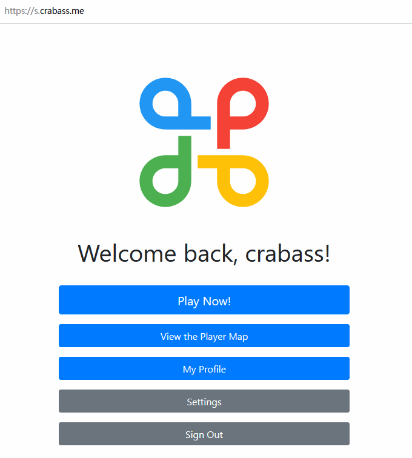

# Surakarta Online
Realtime game hosting of Surakarta using Node.js. This project is still under development. 

## Features in a glance

### Gameplay between Registered User and Anonymous User
* Any user can play Surakarta without registering an account.
* However, an anonymous user will automatically surrender the game if he/she leaves the game.
* Users can know where to move and which chess piece to attack when he/she drags a chess piece.
* The opponent's latest move is clearly shown on the game board.
<p align="center">
  
</p>

### Inherit Game Records & Gameplay between Registered Users
* If an anonymous user previously has played a Surakarta game, he/she can register an account to inherit his/her game records.
* Registered users can easily return to game if he/she accidentally left the game.
<p align="center">
  
</p>

### User Settings
<p align="center">
  
</p>

### Player Map
* Users can choose not to disclose his/her location on the map.
<p align="center">
  
</p>


## Tech Stacks
* WebSocket is used to implement the real-time update of game status between the server and the clients;
* The back-end part of this web-based game is implemented using Node.js. The back-end program is designed to host multiple in-progress games simultaneously. Error prevention is well implemented as well to detect and intercept any cheating request;
* The game board in the front-end part is rendered by paper.js; 
* Data models of games and users are implemented by Mongoose. 

## Game instruction
Please refer to [Surakarta (game)](https://en.wikipedia.org/wiki/Surakarta_(game)).

## Tips of installation
* [Node.js](https://nodejs.org/en/download/package-manager/) and [MongoDB](https://docs.mongodb.com/manual/administration/install-community/) should be installed in advance. 
* HTTP server runs on port `2100` by default. You may change it in `bin/www`([here](/bin/www#L36)).
* [Google reCAPTCHA](https://developers.google.com/recaptcha/docs/invisible) is integrated in this software. Please create a new file as `static_data/recaptcha.json` with following content: 
  ```json
  {"PublicKey": "[YOUR PUBLIC KEY]", "Secret": "[YOUR SECRET KEY]"}
  ```
* Please replace the API key of [Google Maps](https://developers.google.com/maps/documentation/javascript/tutorial) with your own key in `views/stat/map.pug`.
* Please replace the value of `global.DOMAIN_ROOT` with your own hostname in `app.js` ([here](/app.js#L39)). This global constant is to prevent the abuse of the private APIs.

## Roadmap of future development
Please refer to [Roadmap #1](https://github.com/CrabAss/Surakarta-Online/projects/1).

## License
Surakarta Online is licensed under the GNU Affero General Public License as published by the Free Software Foundation, either version 3 of the License, or any later version. For details, please refer to `COPYING`.
